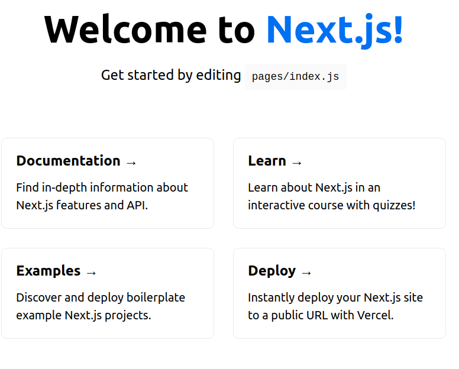

## Next Js Tutorial:
[code_evolution](https://www.youtube.com/watch?v=9P8mASSREYM&list=PLC3y8-rFHvwgC9mj0qv972IO5DmD-H0ZH)

## Introduction

<code>What is Next.js?</code>
- <b>The react framework for production</b><br>
- React
    -  Not quite possible to build a full feature rich application ready to be deployed for production
    - React is a library for building user interfaces.
    - You have to make decision on other features of the app like routing, styling, authentication etc.
- Next.js
    - a package that uses Reac for building user interfaces.
    - Loaded with a lot more features that enable you to build full fledged production ready applications.
    - Features exactly like routing, styling, authentication, bundle optimization etc.
    - Theres no need to install additional packages.Next.js provides everything for you.
    - Opinions and conventions need to be followed to implement the above said features

<code>Why Learn Next.js</code><br>
- Next.js simplifies the process of building a react application for production. 
    - File Based Routing
    - Pre-rendering
    - API Routes
    - Support for CSS modules
    - Authentication
    - Dev and Prod Build system<br>

<code>Why Learn Next.js</code><br>
- HTML,CSS and Javascript Fundamentals
- ES6 + features
- React Fundamentals

<hr>

## Hello World

<code>create a project</code><br>
```
npx create-next-app name-of-file
```

<code>run the project</code><br>

```
npm run dev
```
```
> hello-world@0.1.0 dev /home/rolando/Desktop/learn-new-stacks/hello-world
> next dev

ready - started server on 0.0.0.0:3000, url: http://localhost:3000
info  - Using webpack 5. Reason: Enabled by default https://nextjs.org/docs/messages/webpack5
```
<br>

<hr>

## Project Structure

<code>package.json</code>
- this file contains the dependencies and the scripts required for the project<br>
```
{
  "name": "hello-world",
  "version": "0.1.0",
  "private": true,
  "scripts": {
    "dev": "next dev",
    "build": "next build",
    "start": "next start",
    "lint": "next lint"
  },
  "dependencies": {
    "next": "11.0.1",
    "react": "17.0.2",
    "react-dom": "17.0.2"
  },
  "devDependencies": {
    "eslint": "7.32.0",
    "eslint-config-next": "11.0.1"
  }
}

```

<code>"dependencies"</code>
- react and react dom
    - use to build ui and
- next
    - frame work built on top of react

<code>"devDependencies"</code>
- eslint and eslint-config-next 
    - pslint will help you lint your code
    - highlight warnings and error in your code.

<code>"scripts"</code>
- <code>dev</code>
    - the script runs our next.js application in  development mode with hot code reloading other reporting etc.
- <code>build</code>
    - compiles our next.js application and prepares it for production deployment.
- <code>start</code>
    - start the compiled application in production mode.
    - Note:(<code>if you're building static websites with just react you have a build script but not a start script.You just host your application and there is nothing to start as such.however next js is a full stack framework and you can have a server</code>)
- <code>lint</code>
    - lints all the files in you application


<code>package-lock.json</code><br>
- they simply ensure consisten installation of your dependecies 

<code>.gitignore</code><br>
- tells git which files (or patterns) it should ignore. It's usually used to avoid committing transient files from your working directory that aren't useful to other collaborators, such as compilation products, temporary files IDEs create, etc


<code>Readme files.</code><br>
- readme files contains a few instructions related to running building and deploying the application .

<code>next.config.js</code><br>
- next configuration file
- react strict mode is a development mode only feature for highlighting potential problems in an application
- it helps to identify the unsafe life cycles,legacy api usage, and a number of other features.

<code>eslintrc</code><br>
- the configuration file for eslint.
- the rules by default extend next and next slash core web vitals which is a bunch of rules put together by the next.js team.

<code>.next.js folder</code><br>
- this is a folder that is generated when we run either the dev or the build scripts.
- it is this folder that our next.js application is served from.

<code>node modules</code><br>
- this is the folder in which all the dependencies are installed.
- it is generated when you run the command npm or yarn install.

<code>styles folder</code><br>
- contains some styles for our application.
    - globals styles (global.css)
    - specific styles (Home.module.css)
- this folder does not have any significance as such because it is possible to define styles in a few other folders within the project.
- the create next app command simply groups them in a folder called styles for better organization.

<code>public folder</code><br>
- the important one
- the public folder holds all the public resources for our application
    - wave icons
    - images
    - svgs
    - etc.
- unlike typical react.this folder contains no HTML files.
- all the html files are generated by next.js depending on the type of application you're building.


<code>pages folder</code><br>
- this folder alone is reponsible for the entire routing feature in our application.
    - <code>index.js</code> is the file that gets served in the browser when we visit localhost on port 3000.
    - <code>_app.js</code> where we can define the layout for our application.
    - <code>api folder</code> is where we can create apis for our application.

## flow of control when we run this application.<br>
